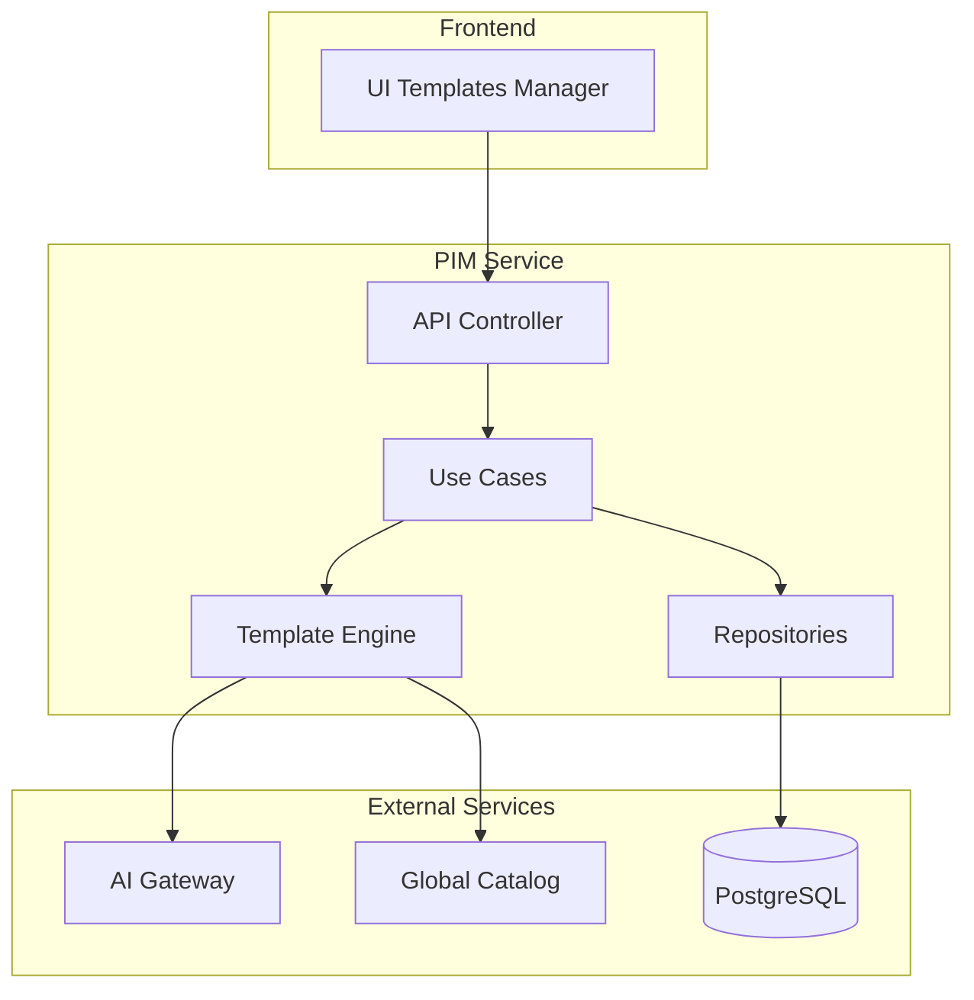
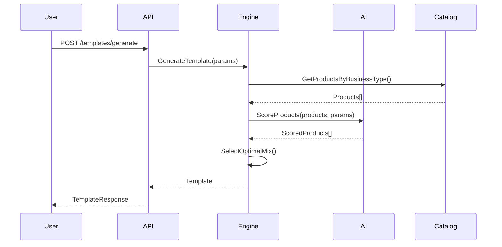
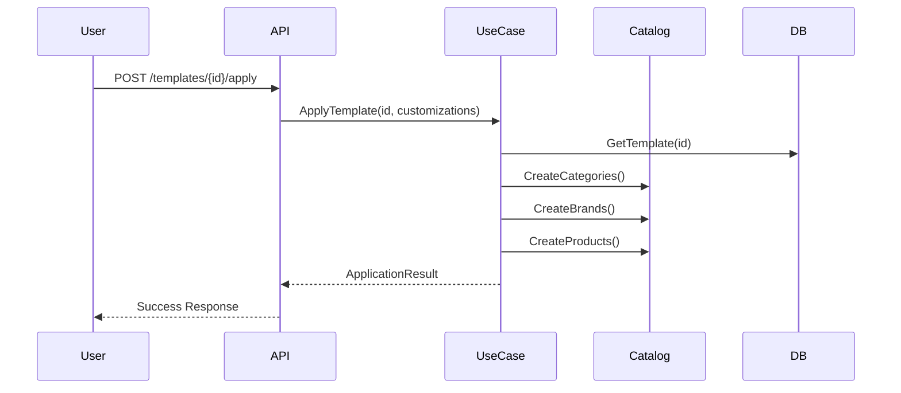

# 🤖 Guía Completa: Sistema de Templates Inteligentes con AI

## 📋 Tabla de Contenidos

1. [Introducción](#introducción)
2. [Arquitectura del Sistema](#arquitectura-del-sistema)
3. [Flujo de Trabajo](#flujo-de-trabajo)
4. [API Reference](#api-reference)
5. [Integración con Catálogo Global](#integración-con-catálogo-global)
6. [Configuración y Deployment](#configuración-y-deployment)
7. [Casos de Uso](#casos-de-uso)
8. [Monitoreo y Métricas](#monitoreo-y-métricas)
9. [Troubleshooting](#troubleshooting)

## 🎯 Introducción

El Sistema de Templates Inteligentes con AI es una funcionalidad avanzada del PIM Service que permite generar catálogos de productos optimizados automáticamente, basándose en:

- **Tipo de negocio**: Almacén, supermercado, farmacia, etc.
- **Ubicación geográfica**: Adaptación regional y local
- **Preferencias específicas**: Rango de precios, marcas, categorías
- **Datos históricos**: Aprendizaje de patrones de éxito

### Beneficios Clave

1. **Onboarding Rápido**: Setup completo en menos de 5 minutos
2. **Optimización Inteligente**: Selección basada en datos y AI
3. **Personalización**: Adaptable a cada negocio
4. **Mejora Continua**: Aprende de feedback y métricas

## 🏗️ Arquitectura del Sistema

### Componentes Principales



### Estructura de Datos

#### Template Entity
```go
type AITemplate struct {
    ID               uuid.UUID
    BusinessTypeID   uuid.UUID
    Name             string
    Version          int
    GeneratedBy      string // "ai", "manual", "hybrid"
    Products         []TemplateGlobalProduct
    GenerationParams map[string]interface{}
    PerformanceMetrics map[string]interface{}
    CreatedAt        time.Time
    UpdatedAt        time.Time
    LastAIUpdate     *time.Time
}
```

#### Template-Product Relationship
```go
type TemplateGlobalProduct struct {
    TemplateID         uuid.UUID
    GlobalProductID    uuid.UUID
    Priority           int     // 1=essential, 2=recommended, 3=optional
    QuantitySuggestion int
    AIReasoning        string
    RelevanceScore     float64
}
```

## 🔄 Flujo de Trabajo

### 1. Generación de Template



### 2. Aplicación de Template



## 📡 API Reference

### 1. Generar Template Inteligente

**Endpoint**: `POST /api/v1/templates/generate`

**Headers**:
```http
Authorization: Bearer {jwt_token}
X-Tenant-ID: {tenant_uuid}
Content-Type: application/json
```

**Request Body**:
```json
{
  "business_type_id": "4f4e9b9e-7b8a-4c6a-9c5a-3e5f7a8b9c1d",
  "name": "Mi Almacén Premium",
  "target_size": "medium",
  "preferences": {
    "price_range": "standard",
    "include_generics": true,
    "generic_percentage": 25,
    "categories_focus": ["bebidas", "snacks", "limpieza"],
    "exclude_brands": ["marca_x"],
    "regional_preferences": "buenos_aires"
  }
}
```

**Response Success (200)**:
```json
{
  "template_id": "550e8400-e29b-41d4-a716-446655440000",
  "name": "Mi Almacén Premium",
  "version": 1,
  "generated_by": "ai",
  "business_type": {
    "id": "4f4e9b9e-7b8a-4c6a-9c5a-3e5f7a8b9c1d",
    "name": "Almacén/Kiosco"
  },
  "products": [
    {
      "global_product_id": "123e4567-e89b-12d3-a456-426614174000",
      "name": "Coca Cola 2.25L",
      "category": "bebidas-gaseosas",
      "brand": "Coca-Cola",
      "priority": 1,
      "quantity_suggestion": 12,
      "price": 1500,
      "relevance_score": 0.95,
      "ai_reasoning": "Producto esencial con alta rotación"
    }
  ],
  "summary": {
    "total_products": 75,
    "categories": 8,
    "brands": 25,
    "estimated_investment": 450000,
    "brand_distribution": {
      "premium": 35,
      "standard": 40,
      "generic": 25
    }
  }
}
```

### 2. Aplicar Template

**Endpoint**: `POST /api/v1/templates/{template_id}/apply`

**Request Body**:
```json
{
  "customizations": {
    "exclude_products": ["123e4567-e89b-12d3-a456-426614174000"],
    "price_multiplier": 1.1,
    "quantity_adjustments": {
      "456e7890-e89b-12d3-a456-426614174001": 24
    }
  },
  "apply_options": {
    "create_categories": true,
    "create_brands": true,
    "create_products": true,
    "initial_stock": false
  }
}
```

### 3. Obtener Performance

**Endpoint**: `GET /api/v1/templates/{template_id}/performance`

**Response**:
```json
{
  "template_id": "550e8400-e29b-41d4-a716-446655440000",
  "performance_metrics": {
    "usage_count": 45,
    "average_satisfaction": 4.2,
    "modification_rate": 0.15,
    "average_products_kept": 0.85,
    "revenue_impact": {
      "average_first_month": 850000,
      "average_growth_rate": 0.12
    }
  },
  "common_modifications": [
    {
      "action": "remove_product",
      "product": "Producto X",
      "frequency": 0.3
    }
  ],
  "regional_performance": {
    "buenos_aires": {
      "usage": 30,
      "satisfaction": 4.3
    }
  }
}
```

### 4. Actualizar con Feedback

**Endpoint**: `POST /api/v1/templates/update-from-feedback`

**Request Body**:
```json
{
  "template_id": "550e8400-e29b-41d4-a716-446655440000",
  "feedback_items": [
    {
      "product_id": "123e4567-e89b-12d3-a456-426614174000",
      "action": "removed",
      "reason": "No se vende bien en esta zona"
    },
    {
      "product_id": "456e7890-e89b-12d3-a456-426614174001",
      "action": "quantity_changed",
      "new_quantity": 24,
      "reason": "Alta demanda"
    }
  ],
  "optimization_goal": "maximize_satisfaction"
}
```

## 🌐 Integración con Catálogo Global

### Flujo de Selección de Productos

1. **Filtrado Inicial**
   - Por tipo de negocio
   - Por disponibilidad regional
   - Por rango de precios

2. **Scoring con AI**
   - Relevancia para el negocio
   - Popularidad regional
   - Margen potencial
   - Complementariedad

3. **Optimización del Mix**
   - Balance de categorías
   - Distribución de marcas
   - Productos esenciales vs opcionales

### Ejemplo de Configuración de Mix

```json
{
  "product_mix": {
    "essential": 0.6,      // 60% productos esenciales
    "recommended": 0.3,    // 30% recomendados
    "optional": 0.1        // 10% opcionales
  },
  "brand_distribution": {
    "premium": 0.35,       // 35% marcas premium
    "standard": 0.40,      // 40% marcas estándar
    "generic": 0.25        // 25% genéricos
  }
}
```

## ⚙️ Configuración y Deployment

### Variables de Entorno

```bash
# AI Gateway
AI_GATEWAY_URL=http://ai-gateway:8000
AI_GATEWAY_API_KEY=your-secure-api-key

# Database
DB_HOST=postgres
DB_PORT=5432
DB_NAME=pim_db
DB_USER=postgres
DB_PASSWORD=secure-password

# Service Configuration
TEMPLATE_CACHE_TTL=3600
MAX_PRODUCTS_PER_TEMPLATE=200
AI_REQUEST_TIMEOUT=30s
```

### Migración de Base de Datos

```bash
# Ejecutar migración 034
cd scripts
./run_migration_034.sh
```

### Docker Compose

```yaml
services:
  pim-service:
    build: .
    environment:
      - AI_GATEWAY_URL=http://ai-gateway:8000
      - AI_GATEWAY_API_KEY=${AI_GATEWAY_API_KEY}
    depends_on:
      - postgres
      - ai-gateway
```

## 📚 Casos de Uso

### Caso 1: Nuevo Almacén en Buenos Aires

```bash
# 1. Generar template
curl -X POST http://localhost:8090/api/v1/templates/generate \
  -H "X-Tenant-ID: tenant-123" \
  -d '{
    "business_type_id": "almacen-id",
    "name": "Almacén Palermo",
    "target_size": "small",
    "preferences": {
      "regional_preferences": "buenos_aires",
      "categories_focus": ["bebidas", "snacks"],
      "price_range": "economy"
    }
  }'

# 2. Aplicar con ajustes
curl -X POST http://localhost:8090/api/v1/templates/{template_id}/apply \
  -H "X-Tenant-ID: tenant-123" \
  -d '{
    "customizations": {
      "price_multiplier": 1.05
    }
  }'
```

### Caso 2: Farmacia con Productos Específicos

```json
{
  "business_type_id": "farmacia-id",
  "preferences": {
    "categories_focus": ["medicamentos-venta-libre", "cuidado-personal"],
    "exclude_brands": ["marca-generica-1"],
    "include_generics": false
  }
}
```

## 📊 Monitoreo y Métricas

### Métricas Clave

1. **Template Generation Metrics**
   - Tiempo de generación
   - Tasa de éxito
   - Productos seleccionados promedio

2. **Application Metrics**
   - Templates aplicados por día
   - Tasa de customización
   - Tiempo de aplicación

3. **Performance Metrics**
   - Satisfacción del usuario
   - Productos modificados
   - ROI estimado

### Dashboard Grafana

```sql
-- Query ejemplo para métricas de uso
SELECT 
    DATE_TRUNC('day', created_at) as date,
    COUNT(*) as templates_generated,
    AVG(json_array_length(products)) as avg_products,
    SUM(CASE WHEN generated_by = 'ai' THEN 1 ELSE 0 END) as ai_generated
FROM business_type_templates
WHERE created_at > NOW() - INTERVAL '30 days'
GROUP BY date
ORDER BY date;
```

## 🔧 Troubleshooting

### Problema: "AI Gateway not responding"

**Síntomas**: Error 500 al generar templates

**Solución**:
1. Verificar conectividad: `curl http://ai-gateway:8000/health`
2. Revisar logs: `docker logs ai-gateway`
3. Verificar API key en variables de entorno

### Problema: "No products found for template"

**Causa**: Catálogo global vacío o filtros muy restrictivos

**Solución**:
1. Verificar productos en catálogo: 
   ```sql
   SELECT COUNT(*) FROM global_products WHERE business_type = 'almacen';
   ```
2. Relajar filtros en la generación
3. Ejecutar importación de productos

### Problema: "Template application timeout"

**Causa**: Demasiados productos o transacciones lentas

**Solución**:
1. Reducir cantidad de productos
2. Aplicar en modo batch
3. Optimizar índices de BD:
   ```sql
   CREATE INDEX idx_template_products ON template_global_products(template_id);
   ```

## 🚀 Mejores Prácticas

1. **Generación de Templates**
   - Usar parámetros específicos para mejores resultados
   - Limitar productos a 100-150 para negocios pequeños
   - Incluir preferencias regionales siempre

2. **Aplicación**
   - Revisar template antes de aplicar
   - Usar customizaciones para ajustes finos
   - Aplicar en horarios de baja carga

3. **Mantenimiento**
   - Actualizar templates con feedback mensualmente
   - Monitorear métricas de performance
   - Ajustar reglas de negocio según resultados

## 📝 Changelog

### v1.0.0 (2025-02-01)
- ✅ Implementación inicial del sistema
- ✅ Integración con AI Gateway
- ✅ Soporte para 4 tipos de negocio
- ✅ Sistema de feedback y métricas