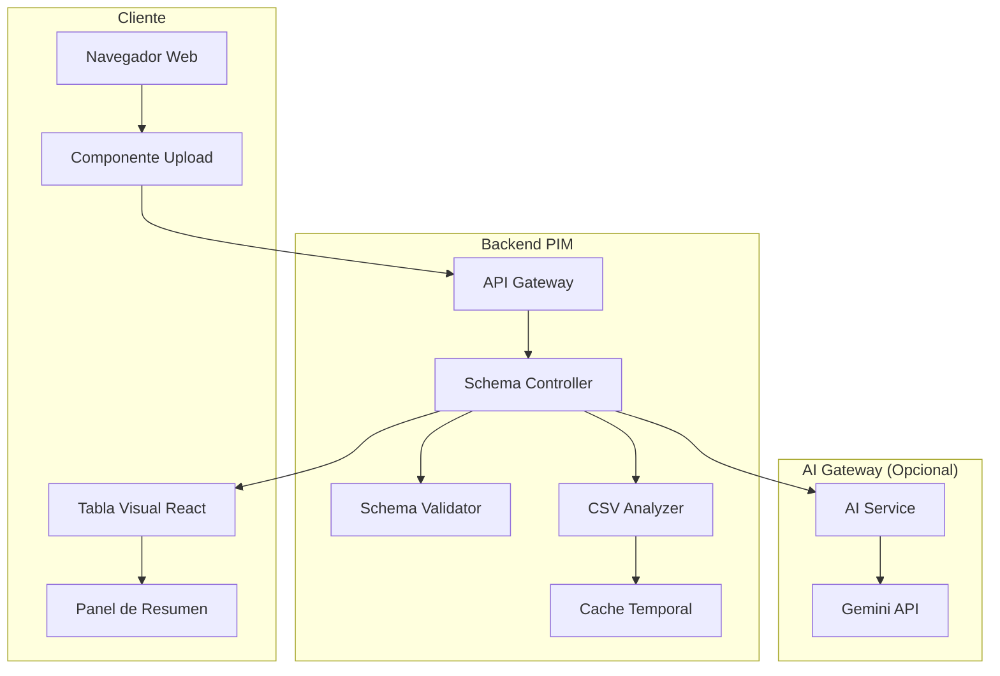
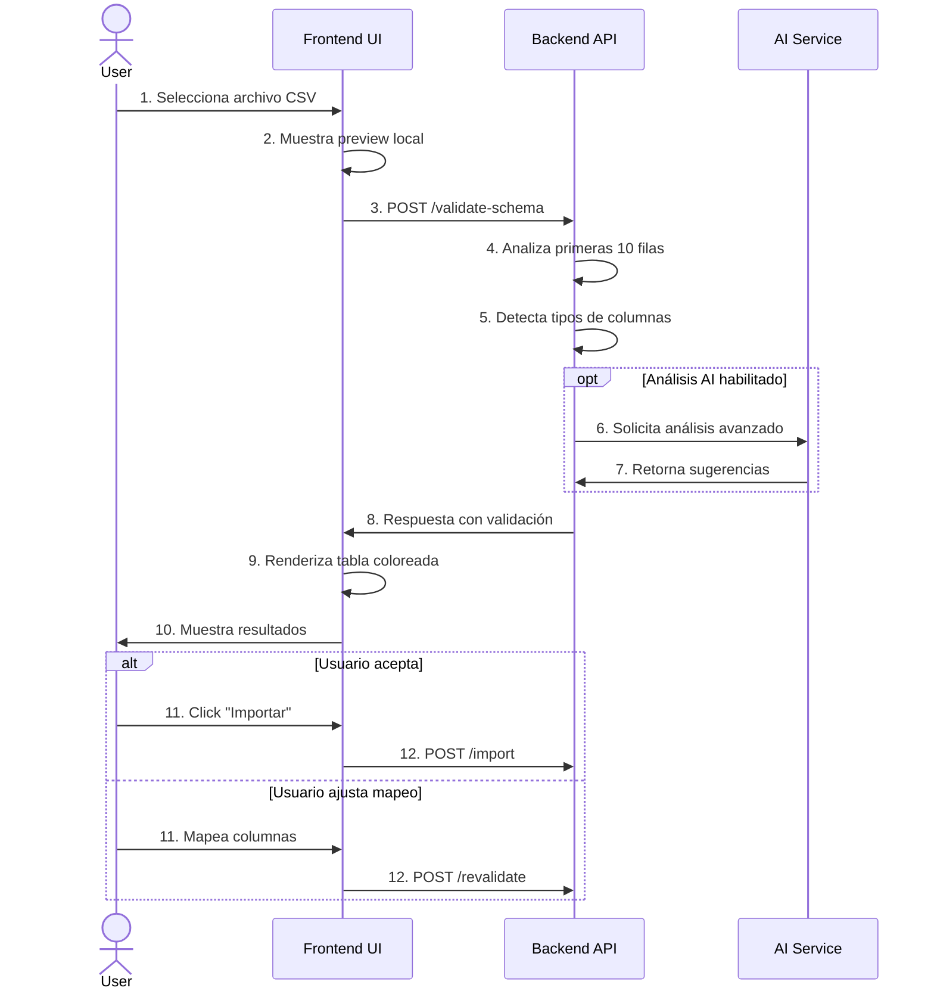

# Sistema de Validación de Schema CSV con Visualización tipo Spreadsheet

## 🎯 Objetivo

Proporcionar una experiencia visual intuitiva para validar archivos CSV antes de importarlos, similar a Excel/Google Sheets, con validación en tiempo real y recomendaciones inteligentes.

## 📋 Tabla de Contenidos
1. [Visión General](#visión-general)
2. [Arquitectura](#arquitectura)
3. [Flujo de Usuario](#flujo-de-usuario)
4. [Componentes del Sistema](#componentes-del-sistema)
5. [Visualización y UX](#visualización-y-ux)
6. [API y Endpoints](#api-y-endpoints)
7. [Ejemplos Prácticos](#ejemplos-prácticos)
8. [Integración con AI](#integración-con-ai)

## 🌟 Visión General

El sistema permite a los usuarios cargar un archivo CSV y ver instantáneamente:
- ✅ Qué columnas son válidas
- ⚠️ Qué datos necesitan corrección
- 🔄 Sugerencias de mapeo automático
- 📊 Vista previa tipo Excel con colores

### Características Principales
- **Validación Visual**: Celdas coloreadas por estado
- **Mapeo Inteligente**: Sugerencias automáticas de columnas
- **Análisis en Tiempo Real**: Feedback inmediato
- **Correcciones Sugeridas**: Recomendaciones accionables

## 🏗️ Arquitectura



## 🔄 Flujo de Usuario



## 🧩 Componentes del Sistema

### 1. Schema de Validación

```typescript
interface SchemaValidationResponse {
  isValid: boolean;
  canImport: boolean;
  columns: Record<string, ColumnValidation>;
  tablePreview: TablePreview;
  summary: ValidationSummary;
  recommendations: string[];
  suggestedMappings: Record<string, string>;
}

interface ColumnValidation {
  name: string;
  status: 'valid' | 'warning' | 'error' | 'info';
  typeExpected: string;
  typeDetected: string;
  required: boolean;
  stats: {
    validCount: number;
    invalidCount: number;
    nullCount: number;
    uniqueCount: number;
  };
  issues: string[];
  sampleValues: string[];
}
```

### 2. Estados de Validación

| Estado | Color | Emoji | Significado |
|--------|-------|-------|-------------|
| Valid | Verde | 🟢 | Valor correcto y válido |
| Warning | Amarillo | 🟡 | Valor aceptable con advertencias |
| Error | Rojo | 🔴 | Valor inválido, requiere corrección |
| Info | Azul | 🔵 | Información adicional, columna no mapeada |

## 🎨 Visualización y UX

### Vista de Tabla Principal

```
┌─────────────────────────────────────────────────────────────────┐
│ 📊 Validación de Schema - productos_import.csv                  │
├─────────────────────────────────────────────────────────────────┤
│                                                                 │
│ Estado General: ⚠️ Advertencias | ✅ 85% válido               │
│                                                                 │
│ ┌─────────────┬────────────┬──────────┬──────────┬───────────┐│
│ │ Producto ⚠️ │ Codigo ❌  │ Precio ✅│ Stock 🔵 │ Marca ⚠️  ││
│ │ ↓ name     │ ↓ sku     │          │ unmapped │ ↓ brand   ││
│ ├─────────────┼────────────┼──────────┼──────────┼───────────┤│
│ │🟢 Laptop   │🟢 DELL001 │🟢 1299.99│🔵 100    │🟡 Dell    ││
│ │   Dell XPS │           │          │          │ (crear?)  ││
│ ├─────────────┼────────────┼──────────┼──────────┼───────────┤│
│ │🟢 Mouse    │🔴 PROD001 │🟢 79.99  │🔵 50     │🟢 Logitech││
│ │   Logitech │ Duplicado │          │          │           ││
│ ├─────────────┼────────────┼──────────┼──────────┼───────────┤│
│ │🔴 (vacío)  │🟢 KEY002  │🔴 -15    │🔵 10     │🟡 Razer   ││
│ │ Requerido  │           │ Negativo │          │ (crear?)  ││
│ └─────────────┴────────────┴──────────┴──────────┴───────────┘│
│                                                                 │
│ 📋 Resumen de Problemas:                                       │
│ • 2 SKUs duplicados (filas 2, 5)                              │
│ • 1 nombre de producto vacío (fila 3)                         │
│ • 1 precio negativo (fila 3)                                  │
│ • Columna "Stock" no está mapeada                             │
│ • 2 marcas nuevas detectadas                                  │
│                                                                 │
│ 💡 Recomendaciones:                                            │
│ • Mapear "Producto" → "name"                                  │
│ • Mapear "Codigo" → "sku"                                     │
│ • Revisar y corregir valores duplicados                       │
│ • Considerar crear las marcas faltantes                       │
│                                                                 │
│ [📥 Descargar Plantilla] [🔄 Revalidar] [✅ Importar] [❌ Cancelar]│
└─────────────────────────────────────────────────────────────────┘
```

### Interacciones de Usuario

1. **Hover sobre celda con error**:
   ```
   ┌─────────────────────────┐
   │ 🔴 PROD001              │
   │ ----------------------- │
   │ Error: SKU duplicado    │
   │ Encontrado en fila 5    │
   │                         │
   │ Sugerencia:            │
   │ Use PROD001-2          │
   └─────────────────────────┘
   ```

2. **Mapeo de columnas**:
   ```
   Producto ⚠️ → [Dropdown: name ▼]
                 ├─ name ✓
                 ├─ description
                 └─ title
   ```

## 🔌 API y Endpoints

### 1. Validar Schema
```http
POST /api/v1/products/validate-schema
Content-Type: multipart/form-data

{
  "file": <CSV file>,
  "use_ai": true,
  "max_rows": 10
}
```

**Response:**
```json
{
  "is_valid": false,
  "can_import": true,
  "columns": {
    "Producto": {
      "name": "Producto",
      "status": "warning",
      "type_expected": "string",
      "type_detected": "string",
      "required": true,
      "stats": {
        "valid_count": 10,
        "invalid_count": 0,
        "null_count": 0,
        "unique_count": 10
      },
      "issues": ["Columna no reconocida, mapear a 'name'"],
      "sample_values": ["Laptop Dell", "Mouse Logitech", "Teclado"]
    }
  },
  "table_preview": {
    "headers": [
      {"name": "Producto", "index": 0, "status": "warning", "mapped_to": "name"}
    ],
    "rows": [
      {
        "row_number": 1,
        "cells": [
          {"value": "Laptop Dell", "status": "valid"},
          {"value": "DELL001", "status": "valid"},
          {"value": "1299.99", "status": "valid"}
        ],
        "row_status": "valid"
      }
    ]
  },
  "summary": {
    "total_rows": 100,
    "valid_rows": 85,
    "rows_with_errors": 10,
    "rows_with_warnings": 5,
    "estimated_success_rate": 85.0
  },
  "recommendations": [
    "Mapear columna 'Producto' a 'name'",
    "Corregir 2 SKUs duplicados",
    "Revisar precio negativo en fila 3"
  ],
  "suggested_mappings": {
    "Producto": "name",
    "Codigo": "sku",
    "Precio": "price"
  }
}
```

### 2. Aplicar Mapeo y Revalidar
```http
POST /api/v1/products/apply-mapping
Content-Type: application/json

{
  "validation_id": "550e8400-e29b-41d4",
  "mappings": {
    "Producto": "name",
    "Codigo": "sku",
    "Precio": "price"
  }
}
```

### 3. Descargar Plantilla
```http
GET /api/v1/products/csv-template

Response: CSV file
"name","sku","description","price","category_id","brand_id","stock"
"Producto ejemplo","SKU001","Descripción del producto",99.99,"","",100
```

## 📊 Ejemplos Prácticos

### Ejemplo 1: CSV con Errores Comunes

**Input CSV:**
```csv
Producto,Codigo,Precio Unit.,Inventario,Marca
Laptop Gaming,GAMER001,1500,50,ASUS
Mouse RGB,GAMER001,45.99,100,Logitech
,KEYB001,-20,30,
Teclado Mecánico,KEYB002,89.99,0,Razer
```

**Análisis del Sistema:**

| Fila | Problema | Severidad | Recomendación |
|------|----------|-----------|---------------|
| 1 | Columnas no mapeadas | ⚠️ Warning | Mapear automáticamente |
| 2 | SKU duplicado | 🔴 Error | Cambiar a GAMER002 |
| 3 | Nombre vacío, precio negativo | 🔴 Error | Completar datos |
| 4 | Stock en 0 | 🟡 Warning | Verificar disponibilidad |

### Ejemplo 2: Mapeo Inteligente

**Detección Automática:**
```
CSV Column          → Sistema Sugiere    → Confianza
"Nombre Producto"   → "name"            → 95%
"Código Artículo"   → "sku"             → 90%
"Precio Unitario"   → "price"           → 98%
"Categoría"         → "category_name"   → 85%
"Stock Disponible"  → "stock"           → 92%
```

## 🤖 Integración con AI

### Prompt para Gemini
```markdown
Analiza estas columnas CSV y sugiere el mejor mapeo:

Columnas encontradas: [Producto, Codigo, Precio Unit., Stock]
Schema esperado: [name, sku, price, description, category_id, stock]

Considera:
- Similitud semántica
- Patrones comunes en español/inglés
- Tipos de datos detectados
```

### Respuesta AI Esperada
```json
{
  "mappings": {
    "Producto": "name",
    "Codigo": "sku",
    "Precio Unit.": "price",
    "Stock": "stock"
  },
  "confidence": 0.95,
  "missing_required": ["description"],
  "suggestions": [
    "Agregar columna 'description' para mejor SEO",
    "Considerar agregar 'category_id' para organización"
  ]
}
```

## 🚀 Próximos Pasos

<function_calls>
<invoke name="exit_plan_mode">
<parameter name="plan">## Plan de Implementación - Sistema de Validación de Schema CSV

### Fase 1: Backend - Estructura Base (2-3 días)
1. **Crear entidades de dominio**
   - `SchemaValidation`: Entidad principal de validación
   - `ColumnValidation`: Validación por columna
   - `CellValidation`: Validación por celda
   - `ValidationStatus`: Value object para estados

2. **Implementar caso de uso ValidateCSVSchemaUseCase**
   - Leer y analizar CSV (primeras N filas)
   - Detectar tipos de datos automáticamente
   - Comparar con schema esperado
   - Generar estadísticas por columna

3. **Crear servicio CSVAnalyzerService**
   - Detección inteligente de tipos
   - Análisis de patrones en datos
   - Sugerencias de mapeo basadas en contenido

4. **Agregar endpoint en ProductController**
   - POST /products/validate-schema
   - POST /products/apply-mapping
   - GET /products/csv-template

### Fase 2: Almacenamiento Temporal (1 día)
1. **Implementar cache para validaciones**
   - Guardar resultado de validación temporalmente
   - Permitir re-validación con nuevos mapeos
   - TTL de 30 minutos

2. **Sistema de archivos temporal**
   - Almacenar CSV para re-procesamiento
   - Limpiar archivos antiguos

### Fase 3: Integración AI (Opcional - 1 día)
1. **Crear servicio de integración con AI Gateway**
   - Endpoint para análisis avanzado
   - Mapeo inteligente con Gemini
   - Detección de patrones complejos

### Fase 4: Frontend (3-4 días)
1. **Componente SchemaValidationTable**
   - Tabla estilo spreadsheet
   - Coloreado por estado de validación
   - Headers interactivos

2. **Panel de resumen y recomendaciones**
   - Estadísticas de validación
   - Lista de problemas
   - Acciones sugeridas

3. **Interacciones de usuario**
   - Mapeo manual de columnas
   - Tooltips con detalles de error
   - Preview de correcciones

### Fase 5: Testing y Refinamiento (1-2 días)
1. **Tests unitarios y de integración**
2. **Optimización de performance**
3. **Documentación de API**
4. **Ajustes de UX basados en feedback**

### Archivos a crear:
```
Backend:
- src/product/tenant/domain/entity/schema_validation.go
- src/product/tenant/domain/value_object/validation_status.go
- src/product/tenant/application/usecase/validate_csv_schema_usecase.go
- src/product/tenant/domain/service/csv_analyzer_service.go
- src/product/tenant/infrastructure/service/ai_schema_analyzer.go
- src/shared/infrastructure/cache/validation_cache.go

Frontend:
- components/import/SchemaValidationTable.tsx
- components/import/ValidationSummaryPanel.tsx
- components/import/ColumnMappingDropdown.tsx
- hooks/useSchemaValidation.ts
- types/schemaValidation.types.ts
```

### Beneficios esperados:
- 📉 Reducción del 80% en errores de importación
- ⏱️ Ahorro de tiempo en corrección de datos
- 🎯 Mayor precisión en mapeo de columnas
- 😊 Mejor experiencia de usuario
- 📊 Visibilidad completa del proceso de validación