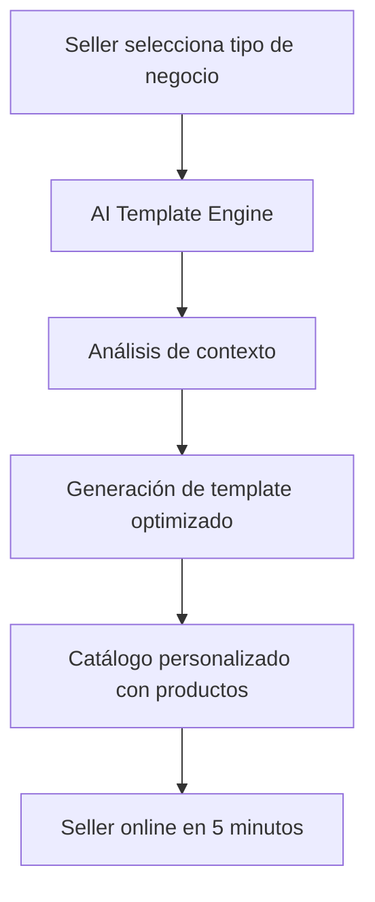

# Guía de Integración: Sistema de Quickstart para Sellers

## 🎯 Objetivo

Facilitar el onboarding de sellers sugiriendo automáticamente categorías relevantes basadas en el tipo de negocio que seleccionen.

## 🏗️ Arquitectura de Datos

```
business_types (Tipos de Negocio)
    ↓
business_type_templates (Templates de Quickstart)
    ↓ (campo: categories JSONB)
marketplace_categories (Categorías del Marketplace)
```

## 📋 Proceso de Onboarding

### 1. Seller selecciona tipo de negocio
El seller elige entre 35 tipos de comercio argentinos disponibles.

### 2. Sistema obtiene categorías sugeridas
```sql
-- Query para obtener categorías sugeridas
SELECT 
    mc.id,
    mc.name,
    mc.slug,
    mc.description,
    mc.parent_id
FROM business_types bt
JOIN business_type_templates btt ON bt.id = btt.business_type_id
CROSS JOIN jsonb_array_elements(btt.categories) as cat_obj
JOIN marketplace_categories mc ON mc.id = (cat_obj->>'id')::uuid
WHERE bt.code = $1  -- Código del tipo de negocio seleccionado
ORDER BY mc.sort_order;
```

### 3. Seller confirma y personaliza categorías
El seller puede:
- ✅ Aceptar categorías sugeridas
- ➕ Agregar categorías adicionales  
- ❌ Remover categorías no relevantes
- 🔄 Reordenar prioridades

## 💻 Implementación en Go

### Servicio de Quickstart

```go
package quickstart

import (
    "context"
    "database/sql/driver"
    "encoding/json"
)

type CategorySuggestion struct {
    ID          string `json:"id"`
    Name        string `json:"name"`
    Slug        string `json:"slug"`
    Description string `json:"description"`
    Level       int    `json:"level"`
    ParentID    *string `json:"parent_id"`
}

type QuickstartService struct {
    db *sql.DB
}

func (s *QuickstartService) GetSuggestedCategories(ctx context.Context, businessTypeCode string) ([]CategorySuggestion, error) {
    query := `
        SELECT 
            mc.id,
            mc.name,
            mc.slug,
            mc.description,
            mc.level,
            mc.parent_id
        FROM business_types bt
        JOIN business_type_templates btt ON bt.id = btt.business_type_id
        CROSS JOIN jsonb_array_elements(btt.categories) as cat_obj
        JOIN marketplace_categories mc ON mc.id = (cat_obj->>'id')::uuid
        WHERE bt.code = $1 AND btt.is_default = true
        ORDER BY mc.sort_order;
    `
    
    rows, err := s.db.QueryContext(ctx, query, businessTypeCode)
    if err != nil {
        return nil, err
    }
    defer rows.Close()
    
    var suggestions []CategorySuggestion
    for rows.Next() {
        var suggestion CategorySuggestion
        err := rows.Scan(
            &suggestion.ID,
            &suggestion.Name,
            &suggestion.Slug,
            &suggestion.Description,
            &suggestion.Level,
            &suggestion.ParentID,
        )
        if err != nil {
            return nil, err
        }
        suggestions = append(suggestions, suggestion)
    }
    
    return suggestions, nil
}

func (s *QuickstartService) ApplyQuickstartTemplate(ctx context.Context, tenantID, businessTypeCode string) error {
    // 1. Obtener categorías sugeridas
    suggestions, err := s.GetSuggestedCategories(ctx, businessTypeCode)
    if err != nil {
        return err
    }
    
    // 2. Crear categorías del tenant basadas en las sugerencias
    tx, err := s.db.BeginTx(ctx, nil)
    if err != nil {
        return err
    }
    defer tx.Rollback()
    
    for _, suggestion := range suggestions {
        _, err := tx.ExecContext(ctx, `
            INSERT INTO tenant_categories (tenant_id, marketplace_category_id, is_active)
            VALUES ($1, $2, true)
            ON CONFLICT (tenant_id, marketplace_category_id) DO NOTHING
        `, tenantID, suggestion.ID)
        if err != nil {
            return err
        }
    }
    
    // 3. Marcar setup como completado
    _, err = tx.ExecContext(ctx, `
        UPDATE tenant_business_type_setup 
        SET setup_completed = true, setup_data = jsonb_build_object('categories_applied', $1)
        WHERE tenant_id = $2
    `, len(suggestions), tenantID)
    if err != nil {
        return err
    }
    
    return tx.Commit()
}
```

### Endpoint REST

```go
// GET /api/v1/quickstart/categories/{businessTypeCode}
func (h *QuickstartHandler) GetSuggestedCategories(w http.ResponseWriter, r *http.Request) {
    businessTypeCode := chi.URLParam(r, "businessTypeCode")
    
    suggestions, err := h.quickstartService.GetSuggestedCategories(r.Context(), businessTypeCode)
    if err != nil {
        http.Error(w, err.Error(), http.StatusInternalServerError)
        return
    }
    
    response := map[string]interface{}{
        "business_type_code": businessTypeCode,
        "suggested_categories": suggestions,
        "total": len(suggestions),
    }
    
    w.Header().Set("Content-Type", "application/json")
    json.NewEncoder(w).Encode(response)
}

// POST /api/v1/quickstart/apply
func (h *QuickstartHandler) ApplyQuickstartTemplate(w http.ResponseWriter, r *http.Request) {
    var request struct {
        TenantID         string   `json:"tenant_id"`
        BusinessTypeCode string   `json:"business_type_code"`
        CategoryIDs      []string `json:"category_ids,omitempty"` // Para personalización
    }
    
    if err := json.NewDecoder(r.Body).Decode(&request); err != nil {
        http.Error(w, "Invalid request body", http.StatusBadRequest)
        return
    }
    
    err := h.quickstartService.ApplyQuickstartTemplate(
        r.Context(), 
        request.TenantID, 
        request.BusinessTypeCode,
    )
    if err != nil {
        http.Error(w, err.Error(), http.StatusInternalServerError)
        return
    }
    
    w.WriteHeader(http.StatusCreated)
    json.NewEncoder(w).Encode(map[string]string{
        "status": "success",
        "message": "Quickstart template applied successfully",
    })
}
```

## 🎨 Integración Frontend

### Componente de Selección de Tipo de Negocio

```typescript
interface BusinessType {
  code: string;
  name: string;
  description: string;
  icon: string;
  color: string;
}

interface CategorySuggestion {
  id: string;
  name: string;
  slug: string;
  description: string;
  level: number;
  parent_id?: string;
}

const BusinessTypeSelector: React.FC = () => {
  const [selectedType, setSelectedType] = useState<string>('');
  const [suggestedCategories, setSuggestedCategories] = useState<CategorySuggestion[]>([]);
  const [loading, setLoading] = useState(false);
  
  const handleTypeSelection = async (typeCode: string) => {
    setSelectedType(typeCode);
    setLoading(true);
    
    try {
      const response = await fetch(`/api/v1/quickstart/categories/${typeCode}`);
      const data = await response.json();
      setSuggestedCategories(data.suggested_categories);
    } catch (error) {
      console.error('Error fetching suggestions:', error);
    } finally {
      setLoading(false);
    }
  };
  
  return (
    <div className="quickstart-wizard">
      <BusinessTypeGrid onSelect={handleTypeSelection} />
      
      {suggestedCategories.length > 0 && (
        <CategorySuggestionsPanel 
          categories={suggestedCategories}
          onApply={handleApplyTemplate}
        />
      )}
    </div>
  );
};
```

## 📊 Ejemplos de Mapeos

### Almacén de Barrio
```json
{
  "business_type": "almacen",
  "suggested_categories": [
    "Alimentos y Bebidas",
    "Alimentos Frescos", 
    "Bebidas",
    "Productos Secos",
    "Lácteos",
    "Limpieza"
  ]
}
```

### Farmacia
```json
{
  "business_type": "farmacia",
  "suggested_categories": [
    "Salud y Farmacia",
    "Medicamentos",
    "Equipos Médicos", 
    "Primeros Auxilios",
    "Belleza y Cuidado Personal"
  ]
}
```

### Ferretería
```json
{
  "business_type": "ferreteria",
  "suggested_categories": [
    "Herramientas y Construcción",
    "Herramientas Manuales",
    "Herramientas Eléctricas",
    "Materiales de Construcción",
    "Pintura",
    "Electricidad",
    "Plomería"
  ]
}
```

## 🔄 Proceso Completo de Onboarding

1. **Selector muestra tipos de negocio** con iconos y descripciones
2. **Seller selecciona tipo** (ej: "Almacén de Barrio")
3. **Sistema sugiere categorías** automáticamente
4. **Seller revisa y confirma** categorías pre-seleccionadas
5. **Sistema aplica template** y crea estructura inicial
6. **Seller puede personalizar** agregando/removiendo categorías
7. **Onboarding completado** con categorías listas para usar

## ✨ Beneficios

- 🚀 **Onboarding más rápido** - Sin necesidad de navegar toda la taxonomía
- 🎯 **Sugerencias inteligentes** - Basadas en lógica de negocio real
- 🇦🇷 **Específico para Argentina** - Tipos y categorías del mercado local
- 🛠️ **Personalizable** - Sellers pueden ajustar según sus necesidades
- 📊 **Data-driven** - Basado en estudios de mercado y facturación

## 🧪 Testing

```bash
# Obtener categorías sugeridas para almacén
curl -X GET "http://localhost:8080/api/v1/quickstart/categories/almacen"

# Aplicar template de quickstart
curl -X POST "http://localhost:8080/api/v1/quickstart/apply" \
  -H "Content-Type: application/json" \
  -d '{
    "tenant_id": "uuid-del-tenant",
    "business_type_code": "almacen"
  }'
```

## 🤖 Evolución: Templates Inteligentes con AI

### Nueva Generación de Quickstart

El sistema de Quickstart evoluciona con AI Templates para ofrecer:

#### 1. **Generación Inteligente de Catálogos**



#### 2. **Comparación: Quickstart Traditional vs AI Templates**

| Característica | Quickstart Tradicional | AI Templates |
|----------------|------------------------|--------------|
| **Contenido** | Solo categorías y atributos | Catálogo completo con productos |
| **Personalización** | Por tipo de negocio | Por tipo + región + preferencias |
| **Productos** | Seller debe agregarlos | 50-150 productos preseleccionados |
| **Tiempo setup** | 30-60 minutos | < 5 minutos |
| **Optimización** | Estática | Dinámica con aprendizaje |

#### 3. **Flujo Mejorado con AI**

```bash
# 1. Generar template inteligente
POST /api/v1/templates/generate
{
  "business_type_id": "almacen-uuid",
  "preferences": {
    "target_size": "medium",
    "regional_preferences": "buenos_aires"
  }
}

# 2. Aplicar template con productos
POST /api/v1/templates/{id}/apply
{
  "apply_options": {
    "create_categories": true,
    "create_products": true
  }
}
```

#### 4. **Beneficios de la Integración**

1. **Para el Seller**
   - Catálogo inicial completo
   - Productos con precios sugeridos
   - Mix optimizado para su negocio
   - Listo para vender inmediatamente

2. **Para el Marketplace**
   - Mayor conversión en onboarding
   - Catálogos de mayor calidad
   - Datos para insights de mercado
   - Diferenciador competitivo

#### 5. **Migración Gradual**

```go
// QuickstartService mejorado
type EnhancedQuickstartService struct {
    traditionalService QuickstartService
    aiTemplateService  AITemplateService
}

func (s *EnhancedQuickstartService) Setup(tenantID uuid.UUID, params SetupParams) error {
    // 1. Setup tradicional (categorías, atributos)
    if err := s.traditionalService.Setup(tenantID, params); err != nil {
        return err
    }
    
    // 2. Si el usuario opta por AI, generar catálogo
    if params.UseAITemplate {
        template, err := s.aiTemplateService.Generate(params)
        if err != nil {
            return err
        }
        
        return s.aiTemplateService.Apply(tenantID, template.ID)
    }
    
    return nil
}
```

### Roadmap de Integración

1. **Fase 1**: AI Templates como opción adicional
2. **Fase 2**: AI Templates por defecto con opt-out
3. **Fase 3**: Sistema unificado inteligente

### Métricas de Éxito

- **Tiempo de onboarding**: De 45 min → 5 min
- **Productos iniciales**: De 0 → 75-150
- **Tasa de completitud**: De 60% → 95%
- **Satisfacción inicial**: De 3.5 → 4.5/5

La evolución natural del Quickstart con AI Templates representa el futuro del onboarding inteligente en marketplaces.

¡El sistema de quickstart está listo para implementar! 🎉 